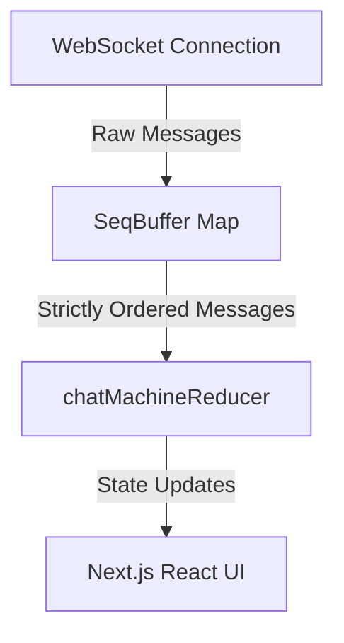

# Agent Console - Chaos Mode Ready

This repository contains the Next.js Agent Console which connects to the mock `agent-server` over WebSockets. It handles token streaming, mid-stream tool call interruptions, live timeline logs, context snapshot diffing, and reconnection recovery.

---

## 📹 Chaos Mode Video Demo

https://github.com/user-attachments/assets/50d065e6-e05d-406c-b8fe-97c9ea44a86d


---

## 🎯 Solution Approach

The system decouples **network state compliance** from the **UI rendering state** using a three-tier architecture:



1. **Sequence Buffer Queue (`SeqBuffer`)**: A custom O(1) buffer backed by a `Map`. It holds out-of-order frames, drops duplicates, and drains only contiguous sequence streams to prevent rendering corruption.
2. **Deterministic State Reducer (`chatMachineReducer`)**: A pure reducer that processes sequence-valid server messages into chat segments, timeline logs, and context snapshot histories.
3. **Resilient Hook Layer (`useAgentConnection`)**: Handles the WebSocket connection, heartbeat compliance (`PING`/`PONG`), tool acknowledgement compliance (`TOOL_ACK`), backoff-based reconnections, and state resume handshakes (`RESUME`).

---

## 📁 Project File Structure

```
your-submission-repo/
├── agent-server/              # Mock backend (provided, unmodified)
│   ├── src/                   # Server endpoints and mock logs
│   ├── Dockerfile             # Docker container definition
│   └── package.json           # Server configuration
│
├── public/                    # Static assets
│
├── src/                       # Frontend Next.js Client
│   ├── app/                   # App Router pages and global CSS styles
│   │   ├── globals.css        # Stylesheet & resets
│   │   ├── layout.tsx         # Root HTML layout and providers
│   │   └── page.tsx           # Main workspace grid layout
│   │
│   ├── components/            # React UI components
│   │   ├── chat/              # Chat message row, text streams, and tool cards
│   │   ├── inspector/         # Context state viewer and diff engine
│   │   ├── timeline/          # Live trace logging panel
│   │   └── ui/                # Shared layout blocks (Cards, Badges, etc.)
│   │
│   ├── hooks/                 # WebSocket hook layer (useAgentConnection.ts)
│   │
│   ├── lib/                   # pure logic helpers
│   │   ├── network/           # sequence buffer and backoff logic
│   │   ├── state/             # chat machine reducer and utility functions
│   │   └── utils/             # common helper functions (cn, etc.)
│   │
│   └── types/                 # Strict TypeScript definitions
│       ├── escapeHatch.ts     # JSON validation helpers
│       ├── machine.ts         # Reducer state definitions
│       └── protocol.ts        # Discriminated unions for WebSocket messages
│
├── package.json               # Development scripts and libraries
├── tsconfig.json              # TypeScript compilation setup
├── next.config.ts             # Next.js bundler config
├── tailwind.config.ts         # Styling layout config
├── postcss.config.mjs         # CSS compiler setup
├── eslint.config.mjs          # Code linter rules
├── README.md                  # Quick-start and solution guide (This file)
└── decisions.md               # Detailed architectural design decisions
```

---

## 🚀 Running the Project

### 1. Run the Agent Server (Backend)

Run using Docker:
```bash
cd agent-server
docker build -t agent-server .
# Normal Mode:
docker run -p 4747:4747 agent-server
# Chaos Mode (Simulate packet drops, duplicates, heartbeat fail, disconnects):
docker run -p 4747:4747 agent-server --mode chaos
```

Or run without Docker:
```bash
cd agent-server
npm install
npm run build
npm start
```

### 2. Run the Next.js App (Frontend)

In the root directory, run:
```bash
# Install dependencies
npm install

# Start the local development server
npm run dev
```

Open [http://localhost:3000](http://localhost:3000) to view the console dashboard.

### 3. Run Automated Tests

To verify sequence ordering buffers and context diff rendering, run:
```bash
npm run test
```
